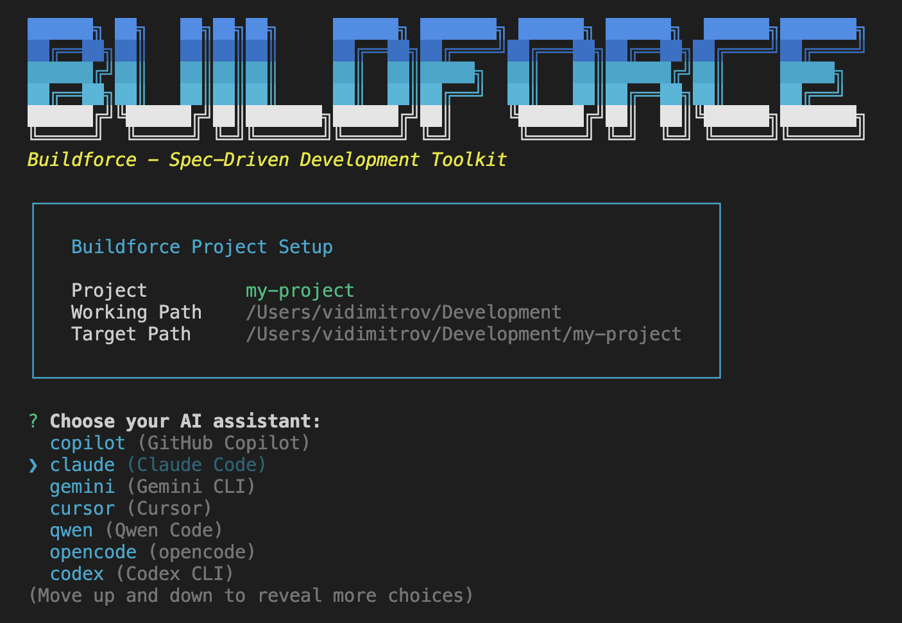

<div align="center">

<picture>
  <source media="(prefers-color-scheme: dark)" srcset=".github/assets/logo-dark.png">
  <source media="(prefers-color-scheme: light)" srcset=".github/assets/logo-light.png">
  
</picture>

**Context-First Spec-Driven Development framework**

[](https://www.npmjs.com/package/@buildforce/cli)
[](https://www.npmjs.com/package/@buildforce/cli)
[](https://github.com/berserkdisruptors/buildforce-cli/stargazers)
[](https://www.apache.org/licenses/LICENSE-2.0)

</div>

---

Buildforce is a **context-first framework for Spec-Driven Development** that works through CLI initialization and slash commands for AI coding agents.

It materializes user intent into structured specifications, generates implementation plans, and tracks execution with full traceability. By creating a persistent **context repository** that accumulates important context across sessions, it enables AI agents to learn from past decisions and maintain consistency across features.

Instead of re-explaining architectural decisions every time you start a new feature, Buildforce preserves them within your repository where they're searchable and reusable.

## Why context-first?

AI agents start fresh with each session and reverse engineer the codebase on-demand. Buildforce inverts this by loading accumulated context first by searching your context repository before you define requirements.

This context-warming approach ensures specs are informed by past decisions, plans reference existing patterns, and implementations remain consistent.

Context persists in version-controlled YAML files alongside your code, so your project's context repository grows smarter with every feature you complete.

Context-first means less time explaining, more time building.

## What Makes It Different

| AI Assistant only                             | AI Assistant + Buildforce                                                             |
| --------------------------------------------- | ------------------------------------------------------------------------------------- |
| Context lost after each session               | Context persists in `.buildforce/context/`                                            |
| No workflow structure                         | Flexible but structured workflows                                                     |
| Requirements exist only in conversation       | User intent captured in `spec.yaml` with acceptance criteria                          |
| Plans exist only in specific modes            | The captured spec is automatically converted into a plan that the user can iterate on |
| Implementation deviations go untracked        | Deviations logged with rationale (Original → Actual → Reason)                         |
| Architectural decisions forgotten             | Decisions preserved, searchable, and enforced via `_guidelines.yaml`                  |
| Knowledge lives in individual developer heads | Shared context repository for team-wide knowledge                                     |
| Each feature starts from scratch              | Each feature builds on accumulated project context                                    |

## Quick Start

### Installation

Install the @buildforce/cli package globally:

```bash
npm install -g @buildforce/cli
```

Then initialize in a project:

```bash
buildforce init .
```

Initialize a new project:

```bash
buildforce init my-project
```

Or with npx:

```bash
npx @buildforce/cli init .
```

<div align="center">

</div>

### Your First Workflow (Hello Buildforce)

Open your AI assistant (Claude Code, Cursor, etc.) in any existing project and run:

```
/research the architecture and structure of this codebase

/buildforce.plan Update README.md to fix any inconsistencies with actual project structure and features

/build

/complete
```

This workflow works on any codebase! Buildforce will analyze your project, identify README inconsistencies, and fix them systematically. Context from `/research` informs your spec. Spec requirements guide the plan. Build executes with deviation tracking. Completion validates everything and saves knowledge to your context repository for future work.

## How It Works

Buildforce uses slash commands inside AI assistant conversations to orchestrate a structured workflow. Unlike typical CLI tools executed in your terminal, Buildforce commands run _within_ your AI chat to guide development phases.

**Workflow visualization:**

```
                     ┌─────────────────────┐
                     │ Context Repository  │
                     └─────────────────────┘
                              ↓           ↑
                        reads │           │ writes
                              │           │
    /research ────────────────┘           │
         ↓                                │
    /buildforce.plan (creates spec/plan)  |
         ↓                                │
    /build (follows the plan and builds)  │
         ↓                                │
    /complete ────────────────────────────┘
```

**What happens at each command:**

- `/research`: Searches `.buildforce/context/` for accumulated knowledge, explores codebase patterns and search web if needed
- `/buildforce.plan`: Materializes user intent into structured requirements (functional, non-functional, acceptance criteria) saved as `spec.yaml` and actionable plan saved as `plan.yaml`. Loads `_guidelines.yaml` as highest-priority context for convention-aware planning
- `/build`: Executes plan phases sequentially, updates progress, logs deviations from the plan on multiple iterations. Validates code compliance against strict/recommended guidelines if `_guidelines.yaml` exists
- `/complete`: Validates all requirements met, generates context files from spec+plan+implementation, updates context repository. Can auto-detect and suggest new guideline patterns
- `/document`: Standalone utility for documenting existing code without full spec-driven cycle. Use `/document guidelines` to capture project conventions

**Three workflow scenarios:**

1. **Basic workflow** (recommended for simple updates):

   ```
   /buildforce.plan → /build
   ```

2. **Full workflow** (recommended for new features and bug fixes):

   ```
   /research → /buildforce.plan → /build → /complete
   ```

3. **Documentation workflow** (manual context contribution):

   ```
   /research [topic] → /document [module]
   ```

4. **Guidelines workflow** (capture and enforce conventions):
   ```
   /document guidelines → /buildforce.plan [feature] → /build → /complete
   ```

The key insight: Buildforce isn't just about individual commands. It's about how commands feed context forward (research informs planning, planning guides build, build enriches context). This orchestration prevents context loss and creates knowledge that compounds over time. Guidelines add convention enforcement—capture patterns with `/document guidelines`, and `/build` validates compliance automatically.

## Commands

### /research - Gather Context

**Purpose**: Search accumulated project context, explore codebase patterns, and fetch current information to inform spec creation.

**Usage:**

```
/research <your-query>
```

**Examples:**

```
/research authentication patterns in this codebase

/research current best practices for error handling in Express.js 2025

/research how pagination is implemented in our API
```

**What it does:**

Searches your project's accumulated context repository first, then explores your codebase and fetches current information from the web when needed. Produces a structured report with file paths, architecture diagrams, data models, and actionable recommendations. Research findings persist in conversation history and can be materialized into structured files during spec creation, ensuring your specifications are always informed by existing patterns and current best practices.

**Pro tip**: Run `/research` before `/buildforce.plan` to ensure specifications are informed by existing patterns and current best practices. Research output stays in context window to guide requirement identification.

---

### /buildforce.plan - Define Requirements & Plan

**Purpose**: Materialize user intent into structured specification defining WHAT needs to be built and HOW to build it.

**Usage:**

```
/buildforce.plan <feature-description>
```

**Examples:**

```
/buildforce.plan Add JWT-based authentication with email/password login and token refresh

/buildforce.plan Fix pagination bug where last page returns empty results

/buildforce.plan Refactor user service to use repository pattern with dependency injection
```

**What it does:**

Converts your feature description into a structured specification with clear requirements, acceptance criteria, and scope boundaries. Creates both a `spec.yaml` (defining WHAT to build) and `plan.yaml` (defining HOW to build it) in a timestamped folder. If you've done research beforehand, it intelligently materializes those findings into a structured file. When requirements are unclear, it asks clarifying questions to ensure everyone's aligned before implementation begins.

**Pro tip**: Run `/buildforce.plan` multiple times to refine requirements and plan. UPDATE mode loads existing spec and plan, allowing iteration without losing previous work.

---

### /build - Execute Implementation

**Purpose**: Execute implementation following spec and plan, with progress tracking and deviation logging.

**Usage:**

```
/build [optional-iteration-instructions]
```

**Examples:**

```
/build

/build Change axios to fetch for HTTP requests

/build Add validation for empty email field
```

**What it does:**

Executes your implementation following the spec and plan, checking off tasks as work progresses and logging any deviations from the original approach. Validates the work against both requirements and plan steps, runs tests, and provides clear guidance on what still needs verification. Supports iterative refinement—you can run it multiple times with feedback to converge on the right solution while maintaining full transparency about what changed and why.

**Pro tip**: Don't try to do everything in one `/build`. Run it, review output, then run `/build [refinement instructions]` to iterate. Deviation log tracks entire journey from first attempt to final implementation.

---

### /complete - Finalize and Validate

**Purpose**: Finalize feature by validating requirements, generating context files, and clearing spec state.

**Usage:**

```
/complete [optional-final-notes]
```

**What it does:**

Validates that all spec requirements are met, reviews the deviation log, and generates a comprehensive completion report. Captures the knowledge from your feature (design decisions, key files, implementation choices) into structured context files that live in your project's context repository. Updates cross-references and clears the active spec state. Requires your explicit confirmation before finalizing—once complete, this feature's knowledge becomes searchable for future work.

**Pro tip**: Don't rush to `/complete`. Validate thoroughly first. Once complete, the feature knowledge enters your context repository and will inform future `/research` queries.

---

### /document - Create Context Files

**Purpose**: Document existing functionality without full spec-driven workflow.

**Usage:**

```
/document <topic-or-module>
```

**Examples:**

```
/document authentication module

/document error handling patterns

/document database connection pooling strategy
```

**What it does:**

Creates or updates structured context files in your project's knowledge repository by analyzing conversation history. Works independently of the spec-driven workflow—perfect for documenting existing code, architectural patterns, or legacy components. Intelligently determines whether to create new files or update existing ones, automatically resolves naming conflicts, and maintains cross-references between related contexts. If your conversation lacks sufficient context, it prompts you to gather more information first.

**Pro tip**: Prepare context window first (read files, discuss architecture) before running `/document`. The command analyzes conversation history to extract documentation, so richer context produces better results. Natural complement to `/research`: research reads context, document writes context.

**Guidelines Mode**: Capture project-wide conventions and coding standards using `/document guidelines`. Creates or updates `_guidelines.yaml` with architectural patterns, naming conventions, and code standards that AI agents enforce during `/build`. Three workflows available:

```
/document guidelines
```

Creates or updates guidelines from conversation (manual mode). Discuss conventions in chat, then run command to capture them as structured guidelines.

```
/document scan guidelines
```

Bootstrap initial guidelines by analyzing existing codebase patterns (scan mode). Detects consistent patterns across 5+ files with 95%+ consistency.

**Enforcement levels**:

- **strict**: Build fails on violation (use for critical conventions)
- **recommended**: Logs warnings only (use for best practices)
- **reference**: Context only, no validation (use for informational patterns)

Guidelines are loaded during `/buildforce.plan` (as planning context), validated during `/build` (code compliance check), and can auto-evolve via `/complete` (pattern detection).

---

## Supported AI Agents

Buildforce works with 11 AI coding agents: Claude Code, Cursor, Codex CLI, Gemini CLI, GitHub Copilot, Windsurf, Kilo Code, Roo Code and Auggie CLI. 

However, at the moment, not all of them are fully tested. That's why we recommend using **Claude Code** or **Cursor** if you are just getting started. 

But if you prefer some of the other supported agents, please give it a try and submit an issue if you see something that doesn't work as expected. Open a new issue if you want to add a new agent to the list.

**How configuration works:**

Buildforce installs slash command files (research.md, plan.md, build.md, complete.md, document.md) into your chosen assistant's configuration folder during initialization. Commands become available in your AI chat via `/research`, `/buildforce.plan`, etc. All templates and scripts are copied to `.buildforce/` in your project directory. You can switch assistants later by manually copying command files between folders.

---

## Contributing

Buildforce is **open source** and welcomes contributions! We're building the future of AI-assisted development together.

### Quick Start for Contributors

```bash
git clone https://github.com/berserkdisruptors/buildforce-cli.git
cd buildforce-cli
npm install
npm run build
npm link
```

### How to Contribute

1. **Check existing issues** - [View open issues](https://github.com/berserkdisruptors/buildforce-cli/issues)
2. **Create an issue** - Describe the problem or feature request
3. **Fork & branch** - Create a feature branch following our naming convention
4. **Use Buildforce for development** - Follow the structured workflow
5. **Test locally** - `npm link` and test your changes
6. **Submit PR** - Describe your changes and link related issues

---

## Support & Community

- **Website**: [https://buildforce.dev](https://buildforce.dev) - Learn more about Buildforce
- **GitHub Repository**: [https://github.com/berserkdisruptors/buildforce-cli](https://github.com/berserkdisruptors/buildforce-cli)
- **npm Package**: [https://www.npmjs.com/package/@buildforce/cli](https://www.npmjs.com/package/@buildforce/cli)
- **GitHub Issues**: [Report bugs or request features](https://github.com/berserkdisruptors/buildforce-cli/issues)
- **Discussions**: [Ask questions or share ideas](https://github.com/berserkdisruptors/buildforce-cli/discussions)

---

## License

Apache License 2.0 License - see [LICENSE](LICENSE) for details.

---

## Star the Project! ⭐

If Buildforce helps you build better software with AI assistants, please star the project on GitHub. It helps us reach more developers and build a stronger community.

[**Star Buildforce on GitHub**](https://github.com/berserkdisruptors/buildforce-cli)

---

**Made with 💪 by [Berserk Disruptors](https://github.com/berserkdisruptors)**

_Building the future of AI-assisted development, one context file at a time._
